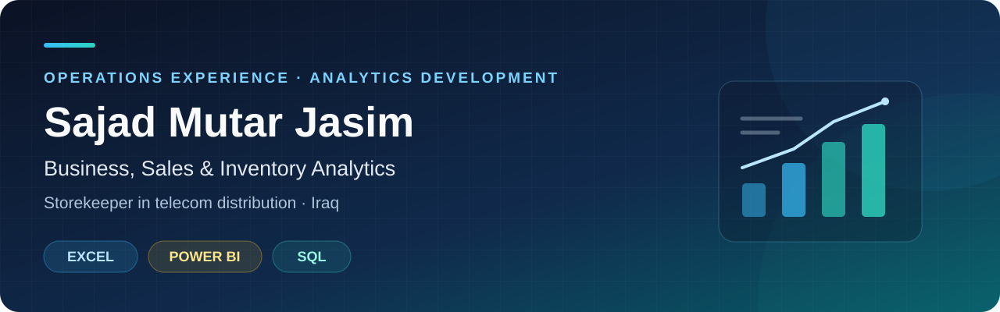

  

  <a href="https://www.linkedin.com/in/sajadmutar/"><strong>Connect on LinkedIn ↗</strong></a>
  &nbsp; · &nbsp;
  <a href="#-learning-projects"><strong>Explore my projects ↓</strong></a>

## 👋 About me

I work as a **storekeeper in telecom distribution in Iraq**, with around **three years of experience** in inventory management and goods movements. I hold a **Bachelor's degree in Business Administration**.

I am developing my data analysis skills to connect operational experience with clearer **business, inventory, and sales reporting**, and prepare for future career opportunities.

## 🧰 Current skills

  

**Excel — Advanced** · **Power BI — Intermediate** · **SQL — Beginner fundamentals**

## 🎯 Analytics interests

| 📦 Inventory & operations | 📊 Sales & business |
| :--- | :--- |
| Stock movements and reconciliation | Sales performance and target tracking |
| Inventory reporting and data quality | Telecom distribution and point-of-sale performance |

## 🔎 Learning projects

These **course-based Python exercises** document my learning in data retrieval, cleaning, and visualization.

| Project | What it covers | Validation |
| :--- | :--- | :--- |
| [**Tesla & GameStop — Stock and Revenue**](https://github.com/sajadmuter/tesla-gamestop-stock-revenue) | Quarterly revenue cleaning, date handling, and historical charts | Offline checks with synthetic fixtures |
| [**Apple — Stock Data Exploration**](https://github.com/sajadmuter/apple-stock-data-exploration) | Stock history retrieval, company information, and opening-price visualization | Offline checks with synthetic fixtures |

> **Scope:** Live-source retrieval has not been verified. These are learning exercises; no market findings or employer business impact are claimed.

## 🚧 Portfolio direction

I am organizing my analytics work into documented case studies focused on **inventory, telecom distribution, and sales performance**.

Each case study will explain the **business question → data preparation → analysis → findings → recommendations**, with clear sources and limitations. Business project links will be added after the files are published and the results are validated.

## 🔐 Data & privacy

For warehouse and telecom portfolio work, I use **synthetic data**. I do not publish employer records, customer information, or confidential commercial data. Public learning datasets are acknowledged in their repositories.

---

  <strong>Arabic — Native</strong> &nbsp; · &nbsp; <strong>English — B1, improving</strong>

  Interested in future opportunities in <strong>data analysis, business reporting, and sales analytics</strong>. 
  <a href="https://www.linkedin.com/in/sajadmutar/"><strong>LinkedIn · Sajad Mutar Jasim ↗</strong></a>

